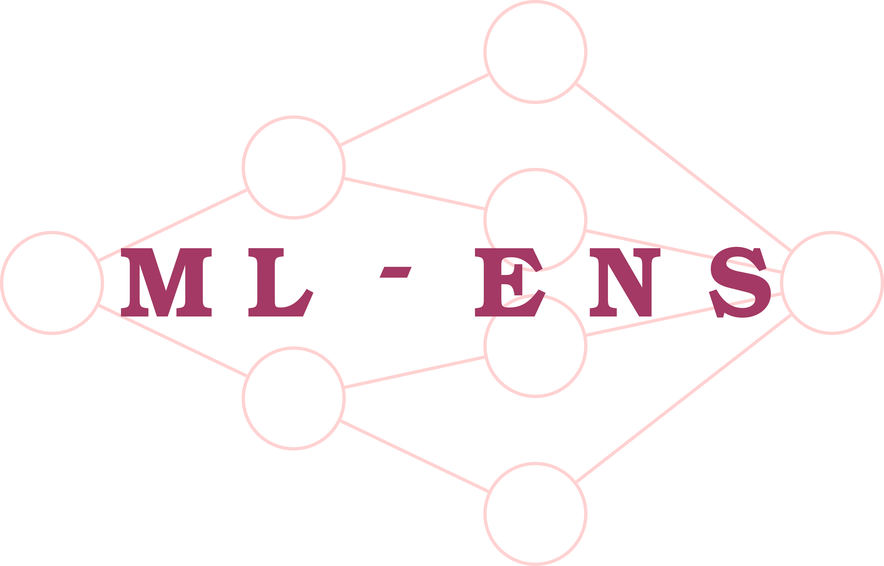
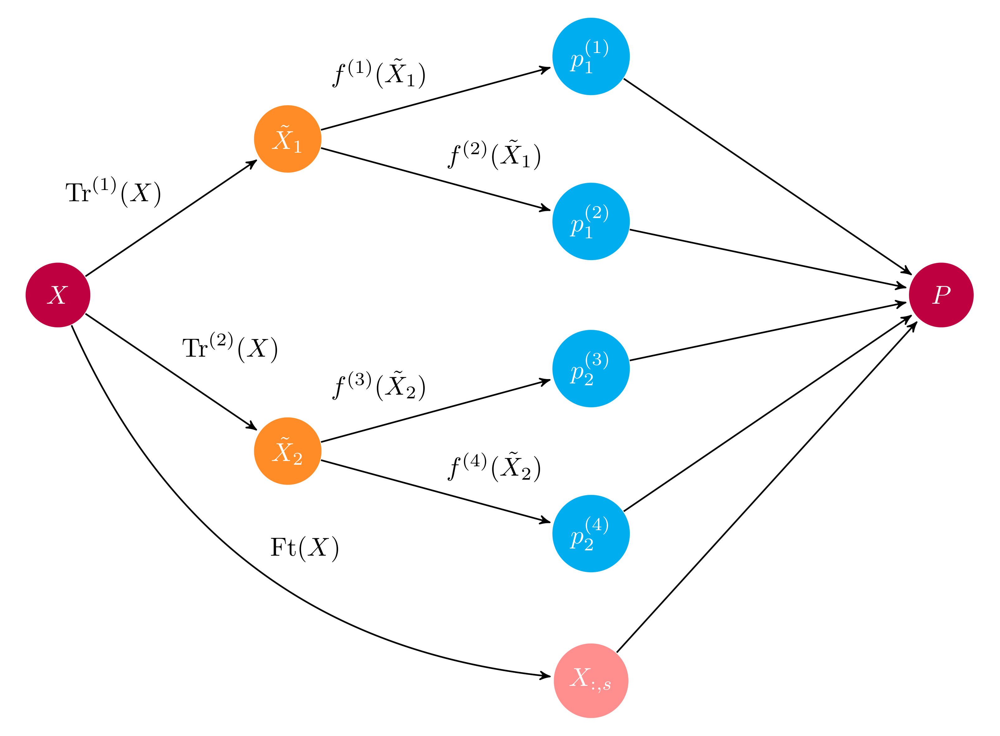

<div align="center">
<br><br>
</div>
<hr>


[](http://badge.fury.io/py/mlens)
[](https://travis-ci.org/flennerhag/mlens)
[](https://ci.appveyor.com/project/flennerhag/mlens/branch/master)
[](https://landscape.io/github/flennerhag/mlens/master)
[](https://coveralls.io/github/flennerhag/mlens?branch=master)

[](https://zenodo.org/badge/latestdoi/78573084)

**A Python library for high performance ensemble learning**

ML-Ensemble combines a Scikit-learn high-level API with a low-level
computational graph framework to build memory efficient, 
maximally parallelized ensemble networks in as few lines of codes as possible.

ML-Ensemble is thread safe as long as base learners are and can fall back on
memory mapped multiprocessing for memory-neutral process-based concurrency.
For tutorials and full documentation, visit the project
 [website](http://ml-ensemble.com/).

## Ensembles as computational graphs

An ensemble is built on top of a computational graph,
allowing users great design freedom. Ensembles can be built with recursion,
dynamic evaluation (e.g. ``if-else``) and much more. A high-level API wraps common
ensemble architectures into Scikit-learn estimators.

<div align="center">
<br><br>
</div>

*Example computational graph of a layer in an ensemble*

### Memory efficient parallelized learning

ML-Ensemble is optimized for speed and minimal memory consumption. No
serialization of data takes place, regardless of whether multithreading or
multiprocessing is used. Additionally, multithreading is pickle-free. 

### Easy of use

Ready-made ensembles are built by adding layers to an instance. No matter how
complex the ensemble, to train it call the ``fit`` method:

```python
ensemble = Subsemble()

# First layer
ensemble.add(list_of_estimators)

# Second layer
ensemble.add(list_of_estimators)

# Final meta estimator
ensemble.add_meta(estimator)

# Train ensemble
ensemble.fit(X, y)
```

Similarly, it's straightforward to modify an existing ensemble:

```python
# Remove layer
ensemble.remove(2)

# Change layer parameters
ensemble.replace(0, new_list_of_estimators)
```

And to create differentiated preprocessing pipelines for different subsets
of estimators within a given layer, simple pass a mapping to the ``add``
method:

```python

preprocessing = {'pipeline-1': list_of_transformers_1,
                 'pipeline-2': list_of_transformers_2}

estimators = {'pipeline-1': list_of_estimators_1,
              'pipeline-2': list_of_estimators_2}

ensemble.add(estimators, preprocessing)
```

### Dedicated diagnostics

ML Ensemble implements a dedicated diagnostics and model selection suite
for intuitive and speedy ensemble evaluation. The ``Evaluator``
allows you to evaluate several preprocessing pipelines and several
estimators in one go, giving you birds-eye view of how different candidates
for the ensemble perform.

Moreover, entire *ensembles* can be used as a preprocessing pipeline, to
leverage model selection for higher-level layers. Simply set ``model_selection``
to ``True`` in the ensemble (don't forget to turn it off when done).

```Python

preprocessing_dict = {'pipeline-1': list_of_transformers_1,
                      'pipeline-2': list_of_transformers_2}


evaluator = Evaluator(scorer=score_func)
evaluator.fit(X, y, list_of_estimators, param_dists_dict, preprocessing_dict)
```

All ensembles and model selection instances provides summary statistics in
tabular format. You can find fit and prediction times in any ensemble by calling
``data``, and cv-scores if you passed a scorer. For the model selection suite,
the ``results`` attribute gives you the outcome of an evaluation::

```Python
              fit_time_mean  fit_time_std  train_score_mean  train_score_std  test_score_mean  test_score_std               params
prep-1 est-1       0.001353      0.001316          0.957037         0.005543         0.960000        0.032660                   {}
       est-2       0.000447      0.000012          0.980000         0.004743         0.966667        0.033333  {'n_neighbors': 15}
prep-2 est-1       0.001000      0.000603          0.957037         0.005543         0.960000        0.032660                   {}
       est-2       0.000448      0.000036          0.965185         0.003395         0.960000        0.044222   {'n_neighbors': 8}
prep-3 est-1       0.000735      0.000248          0.791111         0.019821         0.780000        0.133500                   {}
       est-2       0.000462      0.000143          0.837037         0.014815         0.800000        0.126491   {'n_neighbors': 9}
```

## Install

#### PyPI

ML-Ensemble is available on PyPI. Install with

```bash
pip install mlens
```

#### Bleeding edge

Fork the GitHub repository:

```bash
git clone https://github.com/flennerhag/mlens.git; cd mlens;
python install setup.py
```

## Citation

For scientific publication, ML-Ensemble can be cited as 

```
@misc{flennerhag:2017mlens,
  author = {Flennerhag, Sebastian},
  title  = {ML-Ensemble},
  month  = nov,
  year   = 2017,
  doi    = {10.5281/zenodo.1042144},
  url    = {https://dx.doi.org/10.5281/zenodo.1042144}
}
```

## Questions

Please see [issue tracker](https://github.com/flennerhag/mlens/issues).


## Contribute

ML-Ensemble is an open-source project that welcome any contribution, small as large.
Bug fixes and minor improvements can be pulled as is; larger PRs need to be unit tested. 
We generally follow the [PEP-8](https://www.python.org/dev/peps/pep-0008/) style guide.

## License

MIT License

Copyright (c) 2017–2018 Sebastian Flennerhag

Permission is hereby granted, free of charge, to any person obtaining a copy
of this software and associated documentation files (the "Software"), to deal
in the Software without restriction, including without limitation the rights
to use, copy, modify, merge, publish, distribute, sublicense, and/or sell
copies of the Software, and to permit persons to whom the Software is
furnished to do so, subject to the following conditions:

The above copyright notice and this permission notice shall be included in all
copies or substantial portions of the Software.

THE SOFTWARE IS PROVIDED "AS IS", WITHOUT WARRANTY OF ANY KIND, EXPRESS OR
IMPLIED, INCLUDING BUT NOT LIMITED TO THE WARRANTIES OF MERCHANTABILITY,
FITNESS FOR A PARTICULAR PURPOSE AND NONINFRINGEMENT. IN NO EVENT SHALL THE
AUTHORS OR COPYRIGHT HOLDERS BE LIABLE FOR ANY CLAIM, DAMAGES OR OTHER
LIABILITY, WHETHER IN AN ACTION OF CONTRACT, TORT OR OTHERWISE, ARISING FROM,
OUT OF OR IN CONNECTION WITH THE SOFTWARE OR THE USE OR OTHER DEALINGS IN THE
SOFTWARE.
