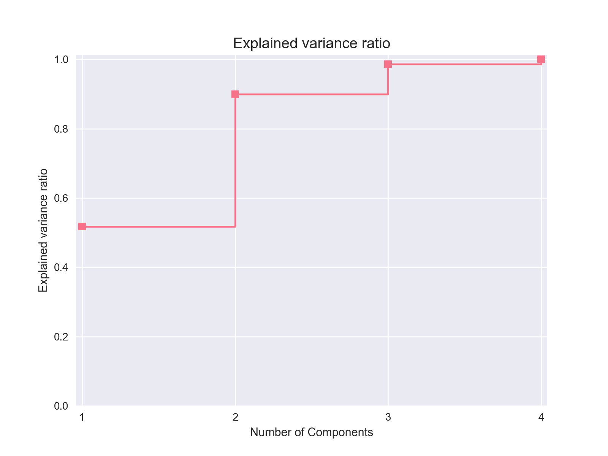
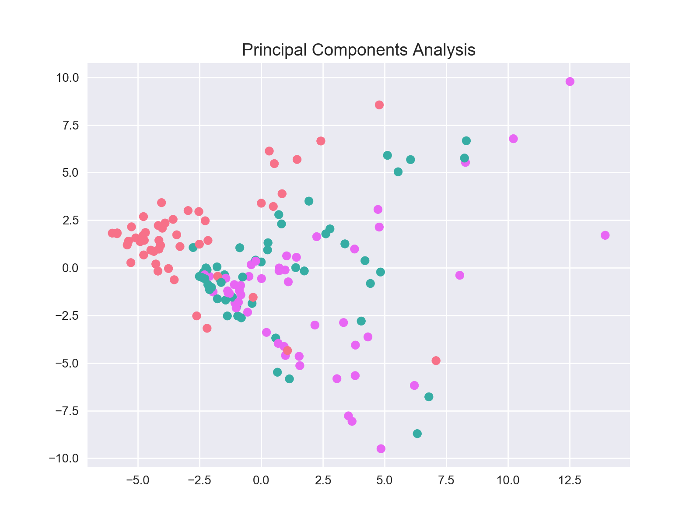
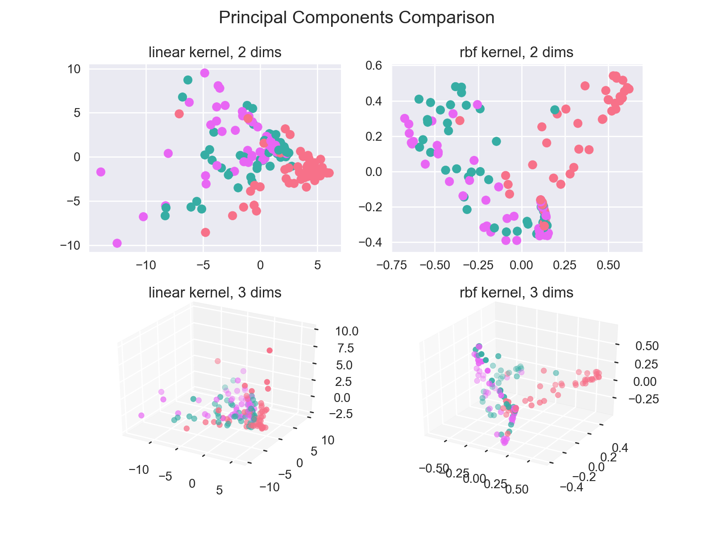
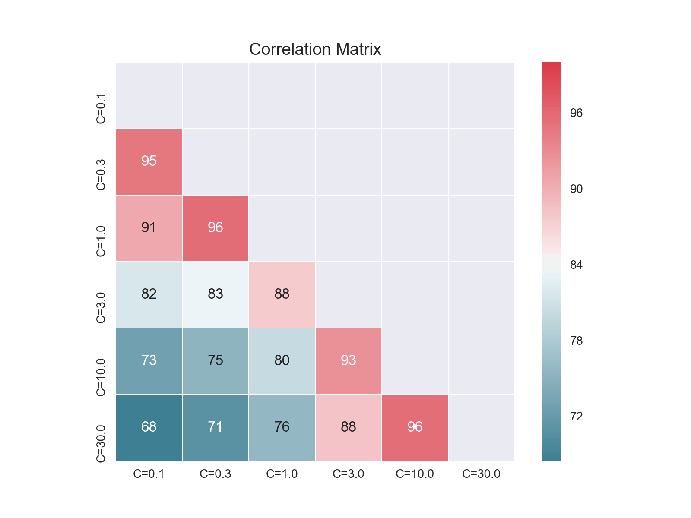
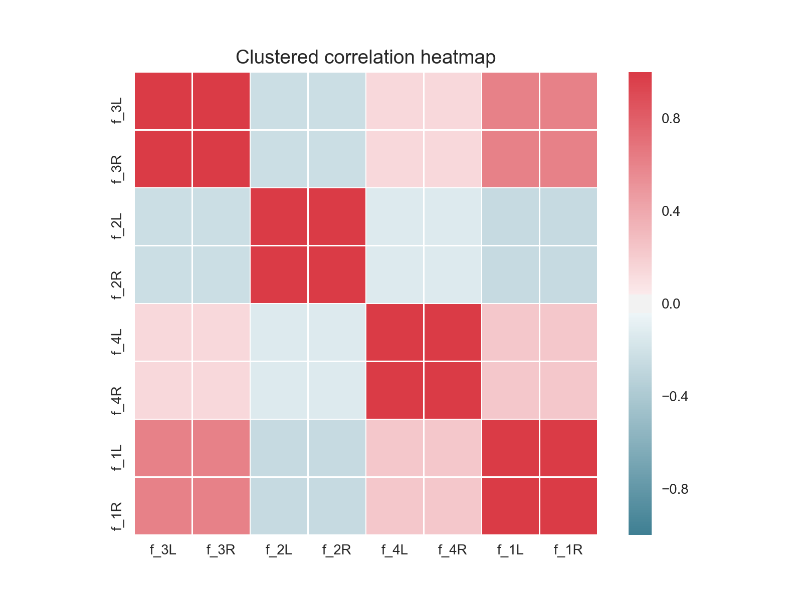
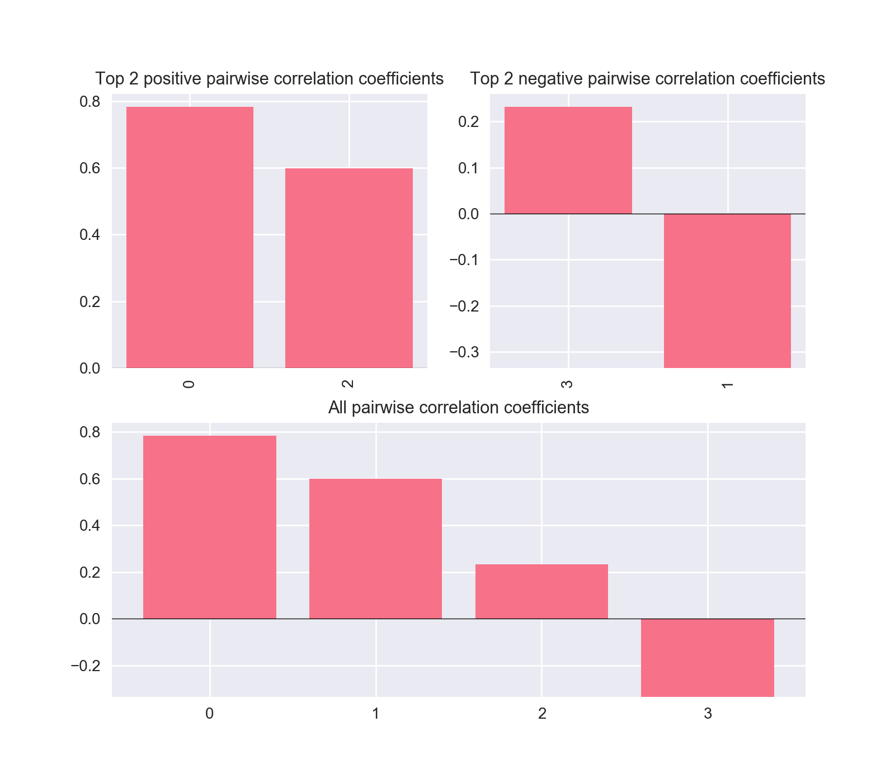

.. Some stuff on getting started

.. _getting-started:

Getting started
===============

To get you up and running, the following guides highlights the basics of the
API for ensemble classes, model selection and visualization.

============================  =================================================
                      Guides                                            Content
============================  =================================================
:ref:`ensemble-guide`         how to build, fit and predict with an ensemble
:ref:`model-selection-guide`  how to evaluate estimators across preprocessing cases
:ref:`visualization-guide`    plotting functionality
============================  =================================================

For more more in-depth material and advanced usage,
see :ref:`ensemble-tutorial`.

Preliminaries
-------------
We use the following setup throughout::

    import numpy as np
    from pandas import DataFrame
    from mlens.metrics import make_scorer
    from sklearn.metrics import f1_score
    from sklearn.datasets import load_iris

    seed = 2017
    np.random.seed(seed)

    f1 = make_scorer(f1_score, average='micro', greater_is_better=True)

    data = load_iris()
    idx = np.random.permutation(150)
    X = data.data[idx]
    y = data.target[idx]

.. _ensemble-guide:

Ensemble guide
--------------

Building an ensemble
^^^^^^^^^^^^^^^^^^^^

Instantiating a fully specified ensemble is straightforward and requires
three steps: first create the instance, second add the intermediate layers, and
finally the meta estimator. ::

    from mlens.ensemble import SuperLearner
    from sklearn.linear_model import LogisticRegression
    from sklearn.ensemble import RandomForestClassifier
    from sklearn.svm import SVC

    # --- Build ---

    # Passing a scorer will create cv scores during fitting
    ensemble = SuperLearner(scorer=f1, random_state=seed)

    # Build the first layer
    ensemble.add([RandomForestClassifier(random_state=seed), SVC()])

    # Attach the final meta estimator
    ensemble.add_meta(LogisticRegression())

    # --- Use ---

    # Fit ensemble
    ensemble.fit(X[:75], y[:75])

    # Predict
    preds = ensemble.predict(X[75:])

To check the performance of estimator in the layers, call the ``scores_``
attribute. The attribute can be wrapped in a :class:`pandas.DataFrame`
for a tabular format. ::

    >>> DataFrame(ensemble.scores_)
                                    score_mean  score_std
    layer-1 randomforestclassifier    0.839260   0.055477
            svc                       0.894026   0.051920

To round off, let's see how the ensemble as a whole fared. ::

    >>> f1_score(preds, y[75:], average='micro')
    0.95999999999999996

Multi-layer ensembles
^^^^^^^^^^^^^^^^^^^^^

With each call to the ``add`` method, another layer is added to the ensemble.
Note that all ensembles are *sequential* in the order layers are added. For
instance, in the above example, we could add a second layer as follows. ::

    ensemble = SuperLearner(scorer=f1, random_state=seed, verbose=True)

    # Build the first layer
    ensemble.add([RandomForestClassifier(random_state=seed), LogisticRegression()])

    # Build the second layer
    ensemble.add([LogisticRegression(), SVC()])

    # Attach the final meta estimator
    ensemble.add_meta(SVC())

We now fit this ensemble in the same manner as before::

    >>> ensemble.fit(X[:75], y[:75])
    Processing layers (3)

    Fitting layer-1
    [Parallel(n_jobs=-1)]: Done   7 out of   6 | elapsed:    0.1s remaining:   -0.0s
    [Parallel(n_jobs=-1)]: Done   7 out of   6 | elapsed:    0.1s remaining:   -0.0s
    [Parallel(n_jobs=-1)]: Done   7 out of   6 | elapsed:    0.1s remaining:   -0.0s
    [Parallel(n_jobs=-1)]: Done   7 out of   6 | elapsed:    0.1s remaining:   -0.0s
    [Parallel(n_jobs=-1)]: Done   7 out of   6 | elapsed:    0.1s remaining:   -0.0s
    [Parallel(n_jobs=-1)]: Done   6 out of   6 | elapsed:    0.1s finished
    layer-1 Done | 00:00:00

    Fitting layer-2
    [Parallel(n_jobs=-1)]: Done   7 out of   6 | elapsed:    0.0s remaining:   -0.0s
    [Parallel(n_jobs=-1)]: Done   7 out of   6 | elapsed:    0.1s remaining:   -0.0s
    [Parallel(n_jobs=-1)]: Done   7 out of   6 | elapsed:    0.1s remaining:   -0.0s
    [Parallel(n_jobs=-1)]: Done   7 out of   6 | elapsed:    0.1s remaining:   -0.0s
    [Parallel(n_jobs=-1)]: Done   7 out of   6 | elapsed:    0.1s remaining:   -0.0s
    [Parallel(n_jobs=-1)]: Done   6 out of   6 | elapsed:    0.1s finished
    layer-2 Done | 00:00:00

    Fitting layer-3
    [Parallel(n_jobs=-1)]: Done   1 out of   1 | elapsed:    0.0s finished
    [Parallel(n_jobs=-1)]: Done   1 out of   1 | elapsed:    0.0s finished
    layer-3 Done | 00:00:00

    Fit complete | 00:00:00

Similarly with predictions::

    >>> preds = ensemble.predict(X[75:])
    Processing layers (3)

    Predicting layer-1
    [Parallel(n_jobs=-1)]: Done   2 out of   2 | elapsed:    0.0s finished
    layer-1 Done | 00:00:00

    Predicting layer-2
    [Parallel(n_jobs=-1)]: Done   2 out of   2 | elapsed:    0.0s finished
    layer-2 Done | 00:00:00

    Predicting layer-3
    [Parallel(n_jobs=-1)]: Done   1 out of   1 | elapsed:    0.0s finished
    layer-3 Done | 00:00:00

    Done | 00:00:00

The design of the ``scores_`` attribute allows an intuitive overview of how
the base learner's perform in each layer. ::

    >>> DataFrame(ensemble.scores_)
                                    score_mean  score_std
    layer-1 logisticregression        0.735420   0.156472
            randomforestclassifier    0.839260   0.055477
    layer-2 logisticregression        0.668208   0.115576
            svc                       0.893314   0.001422

.. _model-selection-guide:

Model selection guide
---------------------

.. currentmodule:: mlens.model_selection

The model selection suite is constantly expanding, so make sure to check in
regularly. The work horse is the :class:`Evaluator` class that allows a user to
evaluate several models in one go across several pipelines. The evaluator class
pre-fits transformers, thus avoiding fitting the same preprocessing
pipelines on the same data repeatedly.

The following example evaluates a `Naive Bayes`_ estimator and a
`K-Nearest-Neighbor`_ estimator under three different preprocessing scenarios:
no preprocessing, standard scaling, and subset selection.
In the latter case, preprocessing is constituted by selecting a subset
:math:`x \subset X` consisting of the two columns of :math:`X`. ::

    from mlens.model_selection import Evaluator
    from mlens.preprocessing import Subset
    from sklearn.preprocessing import StandardScaler

    from sklearn.naive_bayes import GaussianNB
    from sklearn.neighbors import KNeighborsClassifier

    from scipy.stats import randint

    # Map preprocessing cases through a dictionary
    preprocess_cases = {'none': [],
                        'sc': [StandardScaler()],
                        'sub': [Subset([0, 1])]
                        }

    # Instantiate the evaluator
    evaluator = Evaluator(f1, cv=10, random_state=seed, verbose=1)

Once the :class:`Evaluator` is instantiated, we can pre-fit the transformers
before we decide on estimators, if we wish to separate
out the preprocessing part.

.. currentmodule:: mlens.preprocessing

This can be helpful if the preprocessing is time-consuming, for instance if
the preprocessing pipeline is an :class:`EnsembleTransformer`. This class
mimics how an ensemble creates prediction matrices during fit and predict
calls, and can thus be used as a preprocessing pipeline to evaluate different
candidate meta learners. See the :ref:`model-selection-tutorial` tutorial for
an example. To explicitly fit preprocessing pipelines, call ``preprocess``. ::

    >>> evaluator.preprocess(X, y, preprocess_cases)
    Preprocessing 3 preprocessing pipelines over 10 CV folds
    [Parallel(n_jobs=-1)]: Done  30 out of  30 | elapsed:    0.2s finished
    Preprocessing done | 00:00:00

To launch an evaluation, we need a mapping of parameter distributions to
estimators. It is important that the name entries in the
parameter distribution maps to the case *and* the name of the estimator, since
estimators in different cases are likely to find optimal hyper parameter values
in different region of parameter space. If no preprocessing is desired,
simply pass a list of estimator. The list can contain a mixture of named
tuples and estimator instance, like so:
``estimator_list=[estimator_instance, ('name', estimator_instance)]``. In this
example, we map parameter draws to cases and estimators::

    # The Gaussian model has no interesting parameters to tune, se we leave it
    # out. We will rename the KNeighborsClassifier to 'knn' for simplicity.
    pars = {'n_neighbors': randint(2, 20)}
    params = {('sc', 'knn'): pars,
              ('none', 'knn'): pars,
              ('sub', 'knn'): pars}

    ests = [('gnb', GaussianNB()), ('knn', KNeighborsClassifier())]
    estimators = {'sc': ests,
                  'none': ests,
                  'sub': ests}

To run cross-validation, call the ``evaluate`` method.
Make sure to specify the number of parameter draws to evaluate
(the ``n_iter`` parameter). ::

    >>> evaluator.evaluate(X, y, estimators, params, n_iter=10)
    Evaluating 6 estimators for 10 parameter draws 10 CV folds, totalling 600 fits
    [Parallel(n_jobs=-1)]: Done 600 out of 600 | elapsed:    1.0s finished
    Evaluation done | 00:00:01

The results for all parameter draws are stored in ``cv_results``. The
``summary`` attribute contains data pertaining to the best draw for each
estimator in each preprocessing case. These attributes are stored as ``dict``
objects, and can be passed to a :class:`pandas.DataFrame` instance for
a tabular output::

   >>> DataFrame(evaluator.summary)
             train_score_mean  train_score_std  test_score_mean  test_score_std  fit_time_mean  fit_time_std               params
   none gnb          0.957037         0.005543         0.960000        0.032660       0.001000      0.000605                   {}
        knn          0.980000         0.004743         0.966667        0.033333       0.000805      0.000520  {'n_neighbors': 15}
   sc   gnb          0.957037         0.005543         0.960000        0.032660       0.000845      0.000279                   {}
        knn          0.965185         0.003395         0.960000        0.044222       0.000501      0.000168   {'n_neighbors': 8}
   sub  gnb          0.791111         0.019821         0.780000        0.133500       0.001026      0.000625                   {}
        knn          0.837037         0.014815         0.800000        0.126491       0.000675      0.000447   {'n_neighbors': 9}

So we can easily surmise that the two perform similarly when the KNN
use 15 neighbours, the best performing setting. Moreover, the tested
preprocessing pipelines does not seem to help in this case.

.. _visualization-guide:

.. py:currentmodule:: mlens.visualization

Visualization guide
-------------------

**Explained variance plot**

The :class:`exp_var_plot` function
plots the explained variance from mapping a matrix ``X`` onto a smaller
dimension using a user-supplied transformer, such as the Scikit-learn
:class:`sklearn.decomposition.PCA` transformer for
Principal Components Analysis. ::

    >>> from mlens.visualization import exp_var_plot
    >>> from sklearn.decomposition import PCA

    >>> exp_var_plot(X, PCA(), marker='s', where='post')

**Principal Components Analysis plot**

The :class:`pca_plot` function
plots a PCA analysis or similar if ``n_components`` is one of ``[1, 2, 3]``.
By passing a class labels, the plot shows how well separated different classes
are. ::

    >>> from mlens.visualization import pca_plot
    >>> from sklearn.decomposition import PCA

    >>> pca_plot(X, PCA(n_components=2))

**Principal Components Comparison plot**

The :class:`pca_comp_plot` function
plots a matrix of PCA analyses, one for each combination of
``n_components in [1, 2]`` and ``kernel in ['linear', 'rbf']``. ::

    >>> from mlens.visualization import pca_plot_comp

    >>> pca_plot_comp(X, y, figsize=(8, 6))

**Correlation matrix plot**

The :class:`corrmat` function plots the lower triangle of
a correlation matrix. ::

   >>> from mlens.visualization import corrmat
   >>> from sklearn.linear_model import LogisticRegression
   >>> from pandas import DataFrame
   >>>
   >>> # Generate som different predictions to correlate
   >>> params = [0.1, 0.3, 1.0, 3.0, 10, 30]
   >>> preds = []
   >>> for i in params:
   >>>    p = LogisticRegression(C=i).fit(X, y).predict(X)
   >>>    preds.append(p)
   >>>
   >>> preds = np.vstack(preds).T
   >>> corr = DataFrame(preds, columns=['C=%.1f' % i for i in params]).corr()
   >>>
   >>> corrmat(corr)

**Clustered correlation heatmap plot**

The :class:`clustered_corrmap` function is similar to :class:`corrmat`,
but differs in two respects. First, and most importantly, it uses a user
supplied clustering estimator to cluster the correlation matrix on similar
features, which can often help visualize whether there are blocks of highly
correlated features. Secondly, it plots the full matrix (as opposed to the
lower triangle). ::

   >>> from mlens.visualization import clustered_corrmap
   >>> from sklearn.cluster import KMeans
   >>>
   >>> Z = DataFrame(X, columns=['f_%i' %i for i in range(1, 5)])
   >>>
   >>> # We duplicate all features, note that the heatmap orders features
   >>> # as duplicate pairs, and thus fully pick up on this duplication.
   >>> corr = Z.join(Z, lsuffix='L', rsuffix='R').corr()
   >>>
   >>> clustered_corrmap(corr, KMeans())

**Input-Output correlations**

The :class:`corr_X_y` function gives a dashboard of
pairwise correlations between the input data (``X``) and the labels to be
predicted (``y``). If the number of features is large, it is adviced to set
the ``no_ticks`` parameter to ``True``, to avoid rendering an illegible
x-axis. Note that ``X`` must be a :class:`pandas.DataFrame`. ::

   >>> from mlens.visualization import corr_X_y
   >>> from pandas import DataFrame, Series
   >>>
   >>> corr_X_y(DataFrame(X), y, 2)

.. _Scikit-learn:  http://scikit-learn.org/stable/
.. _Random Forest: https://en.wikipedia.org/wiki/Random_forest
.. _Support Vector Machine: https://en.wikipedia.org/wiki/Support_vector_machine
.. _Logistic regression: https://en.wikipedia.org/wiki/Logistic_regression
.. _Naive Bayes: https://en.wikipedia.org/wiki/Naive_Bayes_classifier
.. _K-Nearest-Neighbor: https://en.wikipedia.org/wiki/K-nearest_neighbors_algorithm
