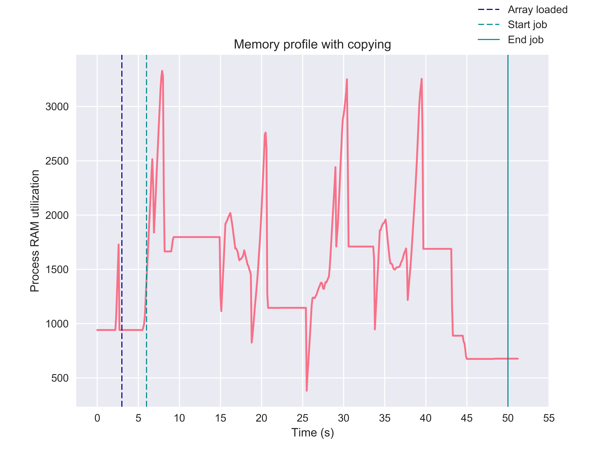
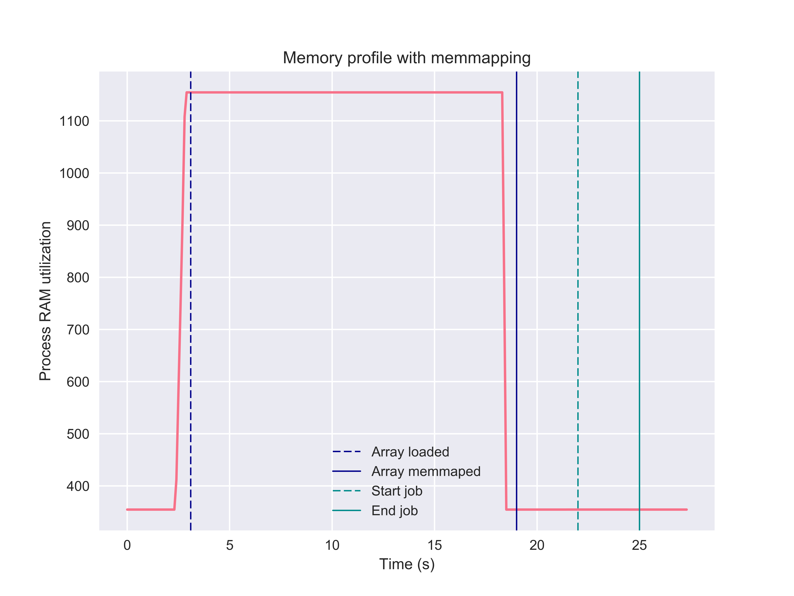
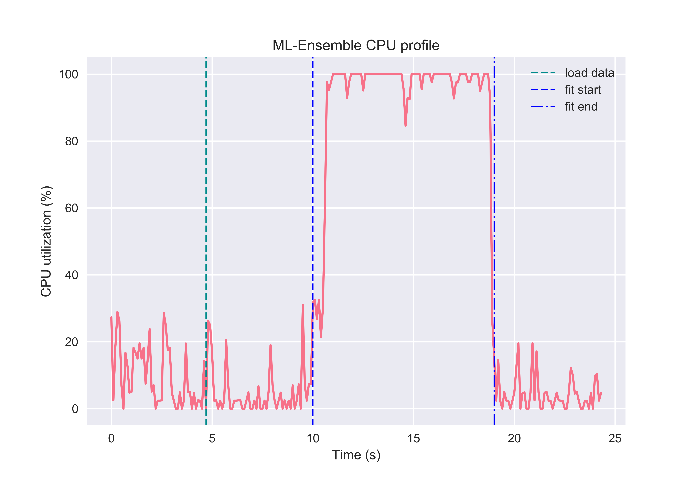
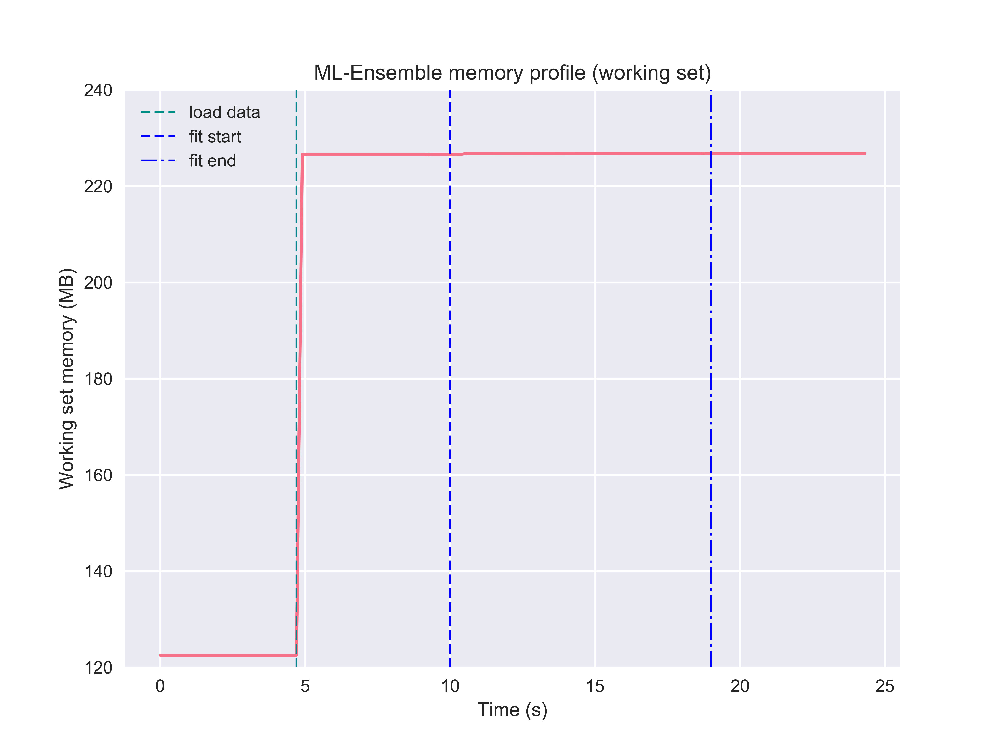
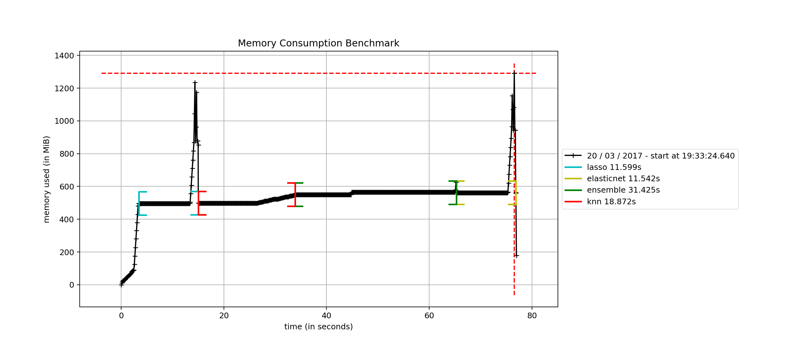

.. Memory benchmark section

.. _memory:

Memory consumption
==================

Memory mapping
^^^^^^^^^^^^^^

.. :currentmodule:: mlens.utils

When training data is stored in-memory in the parent process, training a
ensemble in parallel entails sending the array from the parent process to
the subprocess through serialization of the data. Even for moderately sized
datasets, this is a time consuming task. Moreover, it creates replicas of the
same dataset to be stored in-memory, and so the effective size of the data
kept in memory scales with the number of processes used in parallel. For
large datasets, this can be catastrophic.

ML-Ensemble overcomes this issue by using memmapping_, which allows
sub-processes to share memory of the underlying data. Hence, input data need
not be serialized and sent to the subprocesses, and as long as no copying
takes place in the sub-process, memory consumption remains constant as the
number of sub-processes grows. Hence, ML-Ensemble can remain memory neutral as
the number of CPU's in use increase. This last point relies critically on
avoiding copying, which may not be possible, see :ref:`gotchas` for further
information.

We can easily illustrate this issue by running a dummy function in parallel
that merely holds whatever data it receives from a few seconds before closing.
Here, we make use of the :class:`CMLog` monitor that
logs the memory (and cpu) usage of the process that instantiated it.

::

    >>> import numpy as np
    >>> from joblib import Parallel, delayed
    >>> from time import sleep, perf_counter
    >>> from mlens.utils.utils import CMLog

    >>> def hold(arr, s):
    ...    """Hold an array ``arr`` in memory for ``s`` seconds."""
    ...    sleep(s)

    >>> # Monitor memory usage
    >>> cm = CMLog()
    >>> cm.monitor()

    >>> sleep(3)

    >>> # Load an approx. 800MB array into memory
    >>> t1 = int(np.floor(perf_counter() - cm._t0) * 10)

    >>> array = np.arange(int(1e8)).reshape(int(1e5), int(1e3))

    >>> sleep(3)
    >>> # Launch 4 sub-process, each holding a copy of the array in memory.
    >>> t2 = int(np.floor(perf_counter() - cm._t0) * 10)

    >>> Parallel(n_jobs=-1, verbose=100, max_nbytes=None)(
    ...         delayed(hold)(array, 3)
    ...         for _ in range(4))

    >>> t3 = int(np.floor(perf_counter() - cm._t0) * 10)

    >>> # Job done
    >>> sleep(3)
    >>> cm.collect()
    Pickling array (shape=(100000, 1000), dtype=int64).
    Pickling array (shape=(100000, 1000), dtype=int64).
    [Parallel(n_jobs=-1)]: Done   1 tasks      | elapsed:   17.1s
    Pickling array (shape=(100000, 1000), dtype=int64).
    [Parallel(n_jobs=-1)]: Done   5 out of   4 | elapsed:   26.3s remaining:   -5.3s
    Pickling array (shape=(100000, 1000), dtype=int64).
    [Parallel(n_jobs=-1)]: Done   5 out of   4 | elapsed:   36.4s remaining:   -7.3s
    [Parallel(n_jobs=-1)]: Done   5 out of   4 | elapsed:   43.8s remaining:   -8.8s
    [Parallel(n_jobs=-1)]: Done   4 out of   4 | elapsed:   43.8s finished

Notice that the parallel job seems to be doing an awful lot of data
serialization. The memory log of the ``cm`` reveals that peak memory usage is
over some three times larger than the original array when 4 cpu's are in use.
With such a memory profile, an ensemble would not be very scalable.

Memmapping allows us to overcome these issues for two reaons. First, it entirely
overcomes serialization of the input data as processes share memory and hence
the subprocesses can access the input arrays directly from the parent process.
Second, insofar no copying of the input data takes place, memmapping avoids
scaling the data size requirement by the number of processes running.
To see this first hand, we can modify the above example to convert the toy array to
a memmap and again monitor memory usage. ::

    >>> import os
    >>> import tempfile
    >>> from joblib import load, dump

    >>> with tempfile.TemporaryDirectory() as tmpdir:
    >>>     f = os.path.join(tmpdir, 'arr.mmap')
    >>>     if os.path.exists(f): os.unlink(f)

    >>>     cm = CMLog(True)
    >>>     cm.monitor()

    >>>     sleep(3)

    >>>     array = np.arange(int(1e8)).reshape(int(1e5), int(1e3))
    >>>     t1 = int(np.floor(perf_counter() - cm._t0) * 10)

    >>>     # Now, we dump the array into a memmap in the temporary directory
    >>>     dump(array, f)
    >>>     array = load(f, mmap_mode='r+')
    >>>     t1_d = int(np.floor(perf_counter() - cm._t0) * 10)

    >>>     sleep(3)

    >>>     t2 = int(np.floor(perf_counter() - cm._t0) * 10)

    >>>     Parallel(n_jobs=-1, verbose=100, max_nbytes=None)(
    ...              delayed(hold)(array, 3)
    ...              for _ in range(4))

    >>>     t3 = int(np.floor(perf_counter() - cm._t0) * 10)

    >>>     sleep(3)

    >>>      cm.collect()
    [Parallel(n_jobs=-1)]: Done   1 tasks      | elapsed:    3.0s
    [Parallel(n_jobs=-1)]: Done   5 out of   4 | elapsed:    3.0s remaining:   -0.6s
    [Parallel(n_jobs=-1)]: Done   5 out of   4 | elapsed:    3.0s remaining:   -0.6s
    [Parallel(n_jobs=-1)]: Done   5 out of   4 | elapsed:    3.0s remaining:   -0.6s
    [Parallel(n_jobs=-1)]: Done   4 out of   4 | elapsed:    3.0s finished

Notice first that no pickling is reported in the parallel job; second, the time
to completion is no more than the 3 seconds we asked the ``hold`` function to
sleep. In other words, memmaping causes *no* process time overhead. This stands
in stark contrast to the previous example, which needed over 40 seconds to
complete - an order of magnitude slower. Moreover, inspecting the memory
profile, note that memmapping is completely memory neutral. In fact, if we
replace the original array with the memmap (as in this example),
the memory required to hold the original file can be released and so there
is *no* copy of the array kept in the process memory.

For further details on memmapping in parallel processing,
see the joblib_ package's documentation.

ML-Ensemble memory profiling
^^^^^^^^^^^^^^^^^^^^^^^^^^^^

By leveraging memmapping, ML-Ensemble estimators are able to achieve
memory neutral parallel processing. In the following example, an ensemble of
three linear regression estimators with different preprocessing pipelines are
fitted on data comprising 6 million observations and ten features. The
following profiling can be run from the package root with the below command::

   >>> python benchmarks/memory_cpu_profile.py

Note that the ensemble leveraged the full capacity of the CPU to fit the
ensemble.

And while doing so, memory consumption remained neutral. Note here that becase
the input data was first loaded into memory, then passed to the ensemble,
the original data stays in memory (the ensemble instance cannot
delete objects outside it's scope). To make the ensemble even more memory
efficient, a user can specify a path to a csv file or stored numpy array or
numpy memmap, in which case no memory will be committed to keeping the original
data in memory. See the :ref:`memory-tutorial` tutorial for more information.

Memory performance benchmark
^^^^^^^^^^^^^^^^^^^^^^^^^^^^
.. :currentmodule::`mlens.ensemble`

Finally, we consider how a :class:`SuperLearner` compares in terms of memory
consumption against a set of Scikit-learn estimators. This benchmark
relies on the mprof_ package, which can be installed with ``pip``. The
benchmark compares the :class:`sklearn.linear_model.Lasso`,
:class:`sklearn.linear_model.ElasticNet` and the
:class:`sklearn.neighbors.KNeighborsRegressor` against an ensemble that
uses the former two as the first layer and the latter as a final meta
estimator. ::

   >>> mprof run friedman_memory.py
   >>> mprof plot friedman_memory.py -t "Memory Consumption Benchmark"
   mprof: Sampling memory every 0.1s
   running as a Python program...

   ML-ENSEMBLE

   Benchmark of ML-ENSEMBLE memory profile against Scikit-learn estimators.

   Data shape: (1000000, 50)

   Data size: 400 MB

   Fitting LAS... Done | 00:00:01

   Fitting KNN... Done | 00:00:08

   Fitting ENS... Done | 00:00:21

   Fitting ELN... Done | 00:00:01

   Profiling complete. | 00:01:13

   Using last profile data.

.. _gotchas:

Gotcha's
^^^^^^^^

The above analysis holds under two conditions: (1) no copying of the input
data is triggered during slicing the K-folds and (2) the base estimators
do not copy the data internally. However memmapping always avoids array
serialization between sub-processes which can be significant burden on time
consumption.

**(1)**
Because of the structure of `numpy's memory model`_, slicing an array returns
a view_ only if the slice contiguous. In particular, this means that we
**cannot** slice a numpy array to retrieve two partitions separated by one or
more partitions. Technically, this limitation arises since it breaks the
stride patterns numpy arrays relies on to know where find a row. ML-Ensemble
can therefore **only** avoid copying training data when the number of folds
is 2, in which case the first half is used for training and the latter for
predictions. For 3 of more folds, the training set is no longer contiguous and
hence slicing the original array triggers `advanced indexing`_, in turn
causing a copy of the underlying data to be returned. Being a limitation within
numpy, this issue is beyond the control of ML-Ensemble.

Also note that if the data is preprocessed within ML-Ensemble, transformers
automatically return copies of the input data (i.e. breaks the link with the
memory buffer) and will therefore **always** trigger a copying. In fact, if
it does not, transforming the memmapped original data will raise an ``OSError``
since the memory map of the original data is read-only to avoid corrupting the
input.

**(2)**
The user must take not what input requirements are necessary for a Scikit-learn
estimator to not copy the data, and ensuring the input array is in the given
format. Note that prediction arrays are always dense C-ordered float64 arrays.
For instance, several Scikit-learn linear models defaults to copying the input
data, Scikit-learn random forests estimators copy the data if it is not
Fortran contiguous. Similarly, Scikit-learn SVM models copy data that does not
satisfy its particular requirements.

.. _numpy's memory model: https://docs.scipy.org/doc/numpy/reference/internals.html

.. _view: http://scipy-cookbook.readthedocs.io/items/ViewsVsCopies.html

.. _advanced indexing: https://docs.scipy.org/doc/numpy/reference/arrays.indexing.html

.. _mprof: https://pypi.python.org/pypi/memory_profiler

.. _memmapping: https://docs.scipy.org/doc/numpy/reference/generated/numpy.memmap.html

.. _joblib: https://pythonhosted.org/joblib/parallel.html#working-with-numerical-data-in-shared-memory-memmaping

